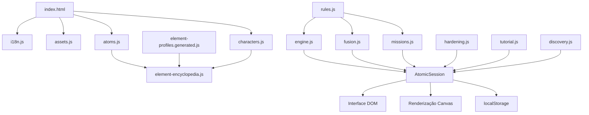

# Combinações Atômicas Idle

Jogo incremental para navegador sobre descoberta de elementos, combinações de núcleos e evolução de um laboratório científico fictício.

O jogador opera o **Anel de Síntese AURORA**, coleta moedas por meio de detectores, injeta núcleos, realiza fusões, descobre elementos, completa missões, compra melhorias e progride por ciclos de prestígio.

> **Estado do projeto:** Build 1 jogável, com progressão até o elemento 118, prestígio, Tabela Periódica vitalícia, História da Química, tutorial, missões, persistência local, interface responsiva e suporte de acessibilidade.

---

## Sumário

1. [Visão geral](#visão-geral)
2. [Proposta científica](#proposta-científica)
3. [Objetivo do jogador](#objetivo-do-jogador)
4. [Fluxo principal de jogo](#fluxo-principal-de-jogo)
5. [Anel de Síntese AURORA](#anel-de-síntese-aurora)
6. [Câmara de síntese](#câmara-de-síntese)
7. [Regras de fusão](#regras-de-fusão)
8. [Progressão do AURORA](#progressão-do-aurora)
9. [Slots da câmara](#slots-da-câmara)
10. [Produção de moedas](#produção-de-moedas)
11. [Melhorias](#melhorias)
12. [Mercado Quântico](#mercado-quântico)
13. [Síntese pós-ferro](#síntese-pós-ferro)
14. [Missões principais](#missões-principais)
15. [Missões especiais](#missões-especiais)
16. [Prestígio](#prestígio)
17. [Descoberta de elementos](#descoberta-de-elementos)
18. [Personagens](#personagens)
19. [Tutorial](#tutorial)
20. [Interface e experiência do usuário](#interface-e-experiência-do-usuário)
21. [Acessibilidade](#acessibilidade)
22. [Persistência](#persistência)
23. [Ganhos offline](#ganhos-offline)
24. [Arquitetura](#arquitetura)
25. [Estrutura de arquivos](#estrutura-de-arquivos)
26. [Ciclo de inicialização](#ciclo-de-inicialização)
27. [Tecnologias utilizadas](#tecnologias-utilizadas)
28. [Como executar](#como-executar)
29. [Testes](#testes)
30. [Como adicionar conteúdo](#como-adicionar-conteúdo)
31. [Desempenho e ciclo de vida](#desempenho-e-ciclo-de-vida)
32. [Limitações conhecidas](#limitações-conhecidas)
33. [Guia de reconstrução](#guia-de-reconstrução)
34. [Licenciamento](#licenciamento)

---

## Visão geral

**Combinações Atômicas Idle** é um jogo incremental educacional construído com HTML, CSS e JavaScript puro.

O jogo combina três objetivos:

- oferecer uma experiência idle/incremental compacta;
- apresentar elementos químicos e conceitos atômicos de maneira acessível;
- manter uma distinção explícita entre mecânica lúdica e física nuclear real.

O núcleo da experiência é o **Anel de Síntese AURORA**, um equipamento fictício no qual núcleos circulam, atravessam detectores e geram recursos.

A moeda principal é utilizada para:

- injetar núcleos;
- melhorar o injetor;
- aumentar a velocidade de circulação;
- instalar detectores;
- desbloquear slots;
- aprimorar o AURORA;
- desenvolver módulos permanentes de síntese pós-ferro.

Uma segunda moeda, representada por fótons, é obtida principalmente em missões especiais e utilizada no Mercado Quântico.

---

## Proposta científica

O jogo usa uma **abstração de síntese nuclear baseada no número atômico**.

Essa abstração existe para criar uma progressão clara e compreensível. Ela não representa uma cadeia completa de reações nucleares reais.

### Número atômico

O número atômico, representado por `Z`, corresponde ao número de prótons no núcleo.

Exemplos:

- Hidrogênio — `Z=1`;
- Hélio — `Z=2`;
- Lítio — `Z=3`;
- Carbono — `Z=6`;
- Ferro — `Z=26`.

O jogo não utiliza expressões como `1H`, `2He` ou `4Be` para representar o número atômico, porque essa notação poderia ser confundida com números de massa ou identificadores de isótopos.

### Número de massa e peso atômico

Número atômico, número de massa e peso atômico são conceitos diferentes:

- **número atômico:** quantidade de prótons;
- **número de massa:** soma de prótons e nêutrons de um isótopo;
- **peso atômico padrão:** média ponderada relacionada à abundância isotópica natural.

Para elementos que não possuem peso atômico padrão, o jogo pode apresentar entre colchetes o número de massa de um radionuclídeo representativo, seguindo a convenção normalmente utilizada em tabelas periódicas.

### Fusão nuclear real

Reatores de fusão estudam principalmente reações entre isótopos leves. Um exemplo importante é a reação entre deutério e trítio, que produz hélio e um nêutron.

O jogo não simula diretamente:

- isótopos;
- balanço de nêutrons;
- decaimentos radioativos;
- conservação detalhada de energia;
- seção de choque;
- produtos emitidos;
- cadeias completas de reação;
- estabilidade nuclear;
- probabilidade física de cada reação.

### Elementos posteriores ao ferro

Elementos mais pesados que o ferro não são apresentados como produtos naturais e energeticamente favoráveis de um tokamak comum.

No universo do jogo, sua obtenção é chamada de:

> **Síntese assistida de núcleos pesados**

Essa síntese exige simultaneamente:

- maior nível do AURORA;
- Resfriamento Criogênico Supercondutor;
- Confinamento Magnético Toroidal;
- moedas;
- progressão anterior compatível.

---

## Objetivo do jogador

O objetivo de uma rodada é evoluir o laboratório até o nível 50, completar a calibração final do AURORA e realizar um prestígio.

Durante esse processo, o jogador deve:

1. gerar moedas;
2. aumentar a capacidade de produção;
3. injetar núcleos;
4. fundir elementos;
5. desbloquear novos números atômicos;
6. completar missões;
7. desenvolver o laboratório;
8. liberar síntese pós-ferro;
9. alcançar os elementos mais pesados;
10. iniciar um novo ciclo com bônus permanente de prestígio.

As descobertas dos elementos são registradas permanentemente no save. Portanto, as fichas de descoberta não reaparecem após um prestígio.

---

## Fluxo principal de jogo

O ciclo básico pode ser representado assim:

```text
Gerar moedas
      ↓
Comprar núcleos e melhorias
      ↓
Organizar a câmara
      ↓
Realizar fusões
      ↓
Descobrir elementos
      ↓
Completar missões
      ↓
Subir o nível do laboratório
      ↓
Aprimorar o AURORA
      ↓
Desbloquear síntese pós-ferro
      ↓
Alcançar o nível 50
      ↓
Prestígio
      ↓
Recomeçar com bônus
```

O jogo possui produção ativa e passiva:

- o jogador pode clicar no AURORA para gerar pulsos manuais;
- partículas em circulação geram renda ao atravessar detectores;
- ganhos offline recompensam períodos fora do jogo;
- buffs temporários aceleram ou amplificam a produção;
- melhorias permanentes aumentam a eficiência entre rodadas.

---

## Anel de Síntese AURORA

O **AURORA** é um equipamento científico fictício criado para o universo do jogo.

Sua representação visual é desenhada proceduralmente em um elemento `<canvas>`. Não existe uma imagem estática única do acelerador. A aparência é formada por código, permitindo que detectores, partículas, brilho e estados sejam atualizados dinamicamente.

O AURORA:

- renderiza o anel;
- posiciona detectores;
- movimenta partículas;
- detecta passagens;
- calcula ganhos;
- exibe efeitos visuais;
- aceita pulsos manuais;
- respeita a preferência de redução de movimento.

### Interação manual

O usuário pode gerar um pulso das seguintes maneiras:

- clicando no canvas;
- pressionando `Enter` com o canvas em foco;
- pressionando `Espaço` com o canvas em foco.

O canvas possui semântica de controle interativo e não depende exclusivamente de mouse.

Quando nenhuma partícula está ativa, o pulso manual recebe um impulso inicial maior para evitar que o jogador fique sem meios de progredir.

### Velocidade básica

A velocidade angular básica das partículas é:

```text
1,35 radianos por segundo
```

Cada partícula possui um pequeno fator individual, normalmente entre `0,95` e `1,05`, para evitar movimento perfeitamente uniforme.

A velocidade efetiva considera:

- velocidade básica;
- melhoria permanente de quadrupolos;
- buff temporário de resfriamento;
- fator individual da partícula;
- configuração de redução de movimento para apresentação visual.

---

## Câmara de síntese

A câmara contém exatamente **8 posições**.

Sua grade visual é fixa:

```text
4 colunas × 2 linhas
```

Os slots bloqueados continuam visíveis, mas não podem receber ou movimentar núcleos.

Cada slot é um botão HTML semântico, não uma `div` simulando um controle.

### Interações possíveis

Com mouse, toque ou teclado, o jogador pode:

- selecionar um slot;
- selecionar um segundo slot;
- mover um núcleo para uma posição vazia;
- trocar núcleos de posição;
- tentar uma fusão;
- vender um núcleo;
- cancelar uma seleção.

O mesmo caminho de regras é utilizado independentemente do método de entrada.

### Restrições

Um slot bloqueado não pode:

- receber um núcleo;
- mover um núcleo;
- vender um núcleo;
- ser selecionado para fusão;
- participar de qualquer reação.

O jogo também impede que existam mais partículas ativas do que slots desbloqueados.

---

## Regras de fusão

A regra foi deliberadamente simplificada para permitir progressão incremental.

Ela está isolada da renderização visual no módulo de regras.

### Hidrogênio como núcleo incremental

Se um dos reagentes possui `Z=1`, o resultado é:

```text
maior Z dos reagentes + 1
```

Exemplos:

```text
H + H → He
H + He → Li
H + Li → Be
H + C → N
```

Essa regra permite criar números atômicos ímpares.

### Núcleos iguais

Se os dois reagentes possuem o mesmo número atômico, o resultado é a soma:

```text
Z + Z
```

Exemplos:

```text
He + He → Be
Li + Li → C
C + C → Mg
Al + Al → Fe
```

### Núcleos incompatíveis

Dois núcleos diferentes, quando nenhum deles é hidrogênio, não produzem uma fusão válida na mecânica atual.

### Limites aplicados

Antes de uma fusão ser aceita, o sistema verifica:

1. se os dois slots estão desbloqueados;
2. se os dois slots possuem núcleos;
3. se a combinação é válida;
4. se o resultado não ultrapassa `Z=118`;
5. se o nível do AURORA suporta o resultado;
6. se o bloqueio pós-ferro foi atendido;
7. se há espaço lógico para manter o produto;
8. se os dados dos elementos existem no registro atômico.

### Registro de reações

Cada fusão real registra:

```javascript
{
  leftZ,
  rightZ,
  resultZ
}
```

Também é criada uma chave normalizada:

```text
menorReagente+maiorReagente=produto
```

Exemplo:

```text
1+2=3
```

Isso permite verificar missões de reações específicas independentemente da ordem dos reagentes.

Comprar, injetar ou receber um elemento não conta como fusão.

---

## Progressão do AURORA

O nível do AURORA limita o maior número atômico sintetizável.

| Nível do AURORA | Maior Z permitido | Marco |
|---:|---:|---|
| 1 | 2 | Hélio |
| 2 | 6 | Carbono |
| 3 | 12 | Magnésio |
| 4 | 26 | Ferro |
| 5 | 31 | Gálio |
| 6 | 36 | Criptônio |
| 7 | 42 | Molibdênio |
| 8 | 48 | Cádmio |
| 9 | 54 | Xenônio |
| 10 | 64 | Gadolínio |
| 11 | 74 | Tungstênio |
| 12 | 84 | Polônio |
| 13 | 100 | Férmio |
| 14 | 118 | Oganessônio |

### Requisitos e custos

| AURORA | Nível do jogador | Custo-base |
|---:|---:|---:|
| 1 | 1 | Inicial |
| 2 | 4 | 250 |
| 3 | 8 | 2.500 |
| 4 | 15 | 28.000 |
| 5 | 23 | 190.000 |
| 6 | 26 | 550.000 |
| 7 | 29 | 1.800.000 |
| 8 | 32 | 5.500.000 |
| 9 | 35 | 16.000.000 |
| 10 | 38 | 48.000.000 |
| 11 | 41 | 140.000.000 |
| 12 | 44 | 420.000.000 |
| 13 | 47 | 1.250.000.000 |
| 14 | 49 | 3.800.000.000 |

Custos sujeitos a ajustes de prestígio são recalculados pela lógica do jogo.

---

## Slots da câmara

No início de uma rodada, somente quatro slots estão ativos.

| Nível do AURORA | Compra permitida |
|---:|---|
| 1 | 4 slots iniciais |
| 2 | 5º slot |
| 3 | 6º slot |
| 4 | 7º slot |
| 5 | 8º slot |

Não existe expansão acima de oito slots.

Quando o AURORA ainda não possui o nível necessário, o botão de compra indica explicitamente:

```text
REQUER NÍVEL X
```

A indisponibilidade não é comunicada apenas pela cor.

### Fórmula de preço

O preço-base de um novo slot segue:

```javascript
Math.ceil(
  600 *
  Math.pow(2.25, slotNumber - 5) *
  Math.pow(1.18, prestigeLevel)
)
```

Onde `slotNumber` varia de 5 a 8.

---

## Produção de moedas

Uma partícula gera moedas quando atravessa um detector.

A renda depende de:

- peso/massa de referência do elemento;
- velocidade angular;
- quantidade de detectores;
- nível de prestígio;
- Pulso de Colisão;
- Condensador Quântico;
- Sorte Quântica.

### Renda por passagem

A estrutura básica do ganho é:

```text
massa do elemento
× multiplicador de prestígio
× Pulso de Colisão
× Condensador Quântico
× resultado de Sorte Quântica
```

Multiplicadores atuais:

| Fonte | Efeito |
|---|---:|
| Prestígio | `prestígio + 1` |
| Pulso de Colisão | `×1,25` |
| Condensador Quântico | `×1,5` |
| Sorte Quântica bem-sucedida | `×2` |

### Estimativa de renda por segundo

Para cada partícula, a estimativa utiliza:

```text
ganho por passagem
× velocidade angular / 2π
× quantidade de detectores
```

O total das partículas é somado e ajustado pelos multiplicadores econômicos ativos.

A barra abaixo do AURORA mostra:

- quantidade de detectores;
- velocidade ou velocidade de fluxo;
- renda estimada por segundo;
- buffs temporários ativos.

Quando um buff afeta velocidade ou renda, o valor correspondente é destacado visualmente e também descrito em texto.

---

## Melhorias

A loja principal reúne injeção, velocidade, detectores, slots e módulos permanentes.

Os cards de compra seguem um padrão visual comum:

- nome;
- descrição curta;
- efeito;
- nível ou quantidade atual;
- custo;
- requisito;
- estado disponível ou bloqueado.

### Injetor de Núcleos

Permite inserir na câmara o núcleo atualmente calibrado.

A injeção:

- exige espaço desbloqueado;
- consome moedas;
- não conta como fusão;
- não satisfaz missões de síntese;
- não dispara descoberta de elemento.

### Calibração do Injetor

Aumenta o número atômico que pode ser comprado diretamente.

A calibração é limitada pela progressão do jogador e pelo nível do AURORA.

O custo-base utiliza o próximo número atômico:

```javascript
Math.floor(35 * Math.pow(nextZ, 1.55))
```

### Focalização por Quadrupolos Magnéticos

Melhora o guiamento e a focalização do feixe, aumentando a velocidade de circulação.

Cada compra concede:

```text
+10% de velocidade
```

O bônus permanente máximo é:

```text
+100%
```

| Compra | Requer LV | Custo-base |
|---:|---:|---:|
| 1 | 3 | 180 |
| 2 | 7 | 950 |
| 3 | 12 | 5.400 |
| 4 | 17 | 32.000 |
| 5 | 22 | 190.000 |
| 6 | 27 | 1.200.000 |
| 7 | 32 | 7.800.000 |
| 8 | 37 | 48.000.000 |
| 9 | 42 | 310.000.000 |
| 10 | 47 | 2.000.000.000 |

### Detectores

Cada detector aumenta a quantidade de pontos de leitura no anel.

O jogador começa com um detector e pode alcançar o máximo de dez.

| Detector adquirido | Requer LV | Custo-base |
|---:|---:|---:|
| 2º | 2 | 120 |
| 3º | 6 | 800 |
| 4º | 11 | 4.500 |
| 5º | 16 | 28.000 |
| 6º | 21 | 180.000 |
| 7º | 28 | 1.100.000 |
| 8º | 35 | 8.500.000 |
| 9º | 41 | 65.000.000 |
| 10º | 46 | 550.000.000 |

---

## Mercado Quântico

O Mercado Quântico utiliza principalmente fótons.

Sua organização visual destaca a injeção de hidrogênio e apresenta as demais opções em uma grade compacta.

### Núcleo-base de hidrogênio

O hidrogênio é especialmente importante porque permite progressão para números atômicos ímpares.

Seu custo-base parte de:

```text
60 moedas
```

O preço final pode ser ajustado pela progressão de prestígio.

### Pulso de Colisão

| Propriedade | Valor |
|---|---|
| Custo | 3 fótons |
| Duração | 15 minutos |
| Efeito | `+25%` de renda |

### Resfriamento do Feixe

| Propriedade | Valor |
|---|---|
| Custo | 4 fótons |
| Duração | 15 minutos |
| Efeito | `+15%` de velocidade |

Esse buff pode ultrapassar o limite permanente de `+100%`.

Exemplo:

```text
Velocidade permanente: +100%
Resfriamento do Feixe: +15%
Velocidade total: +115%
```

O buff usa timestamp. Quando expira, partículas existentes retornam imediatamente à velocidade correta, pois a velocidade final não é gravada permanentemente em cada partícula.

### Condensador Quântico

| Propriedade | Valor |
|---|---|
| Custo | 5 fótons |
| Duração | 15 minutos |
| Efeito | `×1,5` na renda |

### Salto Temporal

Converte imediatamente um período de produção em moedas.

O custo varia aproximadamente entre 1 e 20 fótons conforme o nível do jogador.

### Expansão Offline

Aumenta o período máximo considerado para ganhos offline.

Faixas planejadas pela interface:

```text
1h, 2h, 4h, 8h, 12h, 18h e 24h
```

Custos:

```text
2, 4, 7, 11, 15 e 20 fótons
```

### Sorte Quântica

Melhoria permanente com dez níveis.

Cada nível aumenta a possibilidade de uma passagem produzir ganho dobrado.

Custos:

```text
2, 3, 4, 5, 7, 9, 11, 14, 17 e 20 fótons
```

---

## Síntese pós-ferro

Resultados com `Z > 26` exigem dois módulos permanentes:

1. **Resfriamento Criogênico Supercondutor**
2. **Confinamento Magnético Toroidal**

Cada módulo possui exatamente dez níveis.

O tier efetivo é:

```javascript
Math.min(cryoLevel, toroidalLevel)
```

Portanto, melhorar somente um módulo não libera uma nova faixa.

### Faixas

| Tier | Faixa liberada |
|---:|---|
| 1 | `Z=27–31`, Co a Ga |
| 2 | `Z=32–36`, Ge a Kr |
| 3 | `Z=37–42`, Rb a Mo |
| 4 | `Z=43–48`, Tc a Cd |
| 5 | `Z=49–54`, In a Xe |
| 6 | `Z=55–64`, Cs a Gd |
| 7 | `Z=65–74`, Tb a W |
| 8 | `Z=75–84`, Re a Po |
| 9 | `Z=85–100`, At a Fm |
| 10 | `Z=101–118`, Md a Og |

### AURORA mínimo

| Tier | Nível mínimo do AURORA |
|---:|---:|
| 1 | 5 |
| 2 | 6 |
| 3 | 7 |
| 4 | 8 |
| 5 | 9 |
| 6 | 10 |
| 7 | 11 |
| 8 | 12 |
| 9 | 13 |
| 10 | 14 |

### Ordem de compra

Não é possível comprar o Tier 2 de um módulo se o outro módulo ainda estiver no Tier 0.

Para comprar um novo tier:

- o outro módulo deve ter alcançado o tier anterior;
- o AURORA deve suportar o novo tier;
- o jogador deve possuir moedas suficientes.

### Custo

```javascript
Math.ceil(
  2500 *
  Math.pow(2.1, tier - 1) *
  Math.pow(1.18, prestigeLevel)
)
```

Os dois módulos são preservados no prestígio.

---

## Missões principais

O jogo possui uma sequência de 50 missões principais.

Essas missões orientam a progressão e ensinam:

- geração de moedas;
- compra de detectores;
- melhorias de velocidade;
- injeção;
- fusão;
- descoberta de elementos;
- compra de slots;
- aprimoramento do AURORA;
- desenvolvimento pós-ferro;
- preparação para prestígio.

### Máquina de estados

O gerenciador trabalha com estados explícitos:

```text
active
completed
replacement_active
prestige_ready
```

### Missões específicas

Uma missão pode verificar:

- moedas obtidas;
- passagens em detectores;
- quantidade de fusões;
- uma reação específica;
- um elemento realmente sintetizado;
- compra de slot;
- compra de melhoria;
- compra de módulo;
- nível do AURORA.

Missões de reação consultam o histórico real de reações. Injetar um elemento não é equivalente a sintetizá-lo.

### Missões de substituição

Se uma missão específica já foi satisfeita antes de se tornar ativa, ela não é concluída silenciosamente.

Em vez disso, pode ser transformada em uma missão genérica persistente, por exemplo:

- realizar fusões;
- obter passagens em detectores;
- ganhar moedas por detecção;
- comprar slot;
- comprar módulo aplicável.

A missão de substituição possui:

- tipo próprio;
- alvo próprio;
- progresso;
- texto;
- estado persistido.

### Escalonamento

Metas podem utilizar:

```javascript
base * Math.pow(1.18, prestigeLevel)
```

São aplicados limites para evitar objetivos impraticáveis.

Alguns modelos de substituição incluem:

```text
Fusões: 5 + nível do jogador
Passagens: 20 + nível do jogador × 3
Moedas: 400 × 1,12 ^ nível do jogador
```

A missão final do nível 50 não é convertida automaticamente em substituição.

---

## Missões especiais

As missões especiais funcionam como objetivos secundários.

Elas:

- são sorteadas de um conjunto elegível;
- respeitam a progressão disponível;
- evitam solicitar elementos inalcançáveis;
- concedem fótons;
- possuem proteção contra recompensa dupla.

Uma missão pesada de fusão não deve ser sorteada se o nível do AURORA, os módulos ou a câmara ainda não permitirem cumpri-la.

---

## Prestígio

O prestígio é liberado no nível 50, após o cumprimento do objetivo final de calibração.

A interface representa o prestígio como:

```text
LV 0
LV 1
LV 2
...
```

### Benefício

O multiplicador econômico básico é:

```javascript
prestigeLevel + 1
```

Exemplos:

| Prestígio | Multiplicador |
|---:|---:|
| 0 | `×1` |
| 1 | `×2` |
| 2 | `×3` |
| 3 | `×4` |

### Reiniciado no prestígio

- nível do jogador;
- moedas da rodada;
- velocidade permanente comum;
- detectores;
- nível do AURORA;
- slots comprados;
- núcleos da câmara;
- missão principal;
- contadores da rodada;
- elementos sintetizados na rodada;
- histórico de reações da rodada.

A nova rodada começa com:

- AURORA nível 1;
- quatro slots;
- um núcleo de hidrogênio;
- moedas iniciais calculadas conforme o novo prestígio;
- um detector.

### Preservado no prestígio

- nível de prestígio;
- elementos descobertos vitaliciamente;
- fichas de descoberta já exibidas;
- estado de apresentação do hidrogênio;
- módulos pós-ferro;
- melhorias permanentes aplicáveis;
- dados vitalícios necessários.

---

## Descoberta de elementos

O sistema possui perfis para os 118 elementos.

Uma descoberta somente acontece quando o elemento é produzido por uma fusão válida.

Não contam como descoberta:

- compra;
- injeção;
- restauração de save;
- atribuição manual;
- simples aumento do maior Z alcançado.

### Ficha de descoberta

Quando um elemento é descoberto pela primeira vez no save, uma ficha é exibida com:

- imagem do elemento;
- nome;
- símbolo;
- número atômico;
- massa ou peso de referência;
- configuração eletrônica;
- grupo;
- período;
- família;
- bloco;
- classificação;
- estado físico;
- informações de descoberta histórica;
- ocorrência;
- aplicações;
- presença no cotidiano;
- curiosidade;
- segurança;
- comentário de um personagem.

A ficha usa o Markdown correspondente ao elemento como fonte editorial.

### Tabela Periódica das Descobertas

O painel do AURORA oferece acesso a uma tabela periódica compacta com os 118 elementos em suas posições químicas. Elementos ainda não descobertos permanecem ocultos; descobertas vitalícias revelam número atômico, símbolo, nome, massa e imagem. Uma célula revelada pode reabrir a ficha enciclopédica sem registrar uma nova descoberta ou conceder progresso duplicado.

A tabela calcula dez conquistas de coleções químicas — metais alcalinos, alcalino-terrosos, metais de transição, metais pós-transição, semimetais, outros não metais, halogênios, gases nobres, lantanídeos e actinídeos — além da insígnia máxima pelos 118 elementos.

O progresso não possui estado separado no save: ele é sempre derivado de `discoveredElementsLifetime`. Como esse conjunto é vitalício e preservado no prestígio, células e insígnias também permanecem entre rodadas.

### Exibição única

O conjunto de descobertas vitalícias é persistido.

Assim, se o jogador descobrir novamente o mesmo elemento depois de um prestígio, a ficha não será exibida outra vez.

### Hidrogênio inicial

O jogador começa com hidrogênio. Após a conclusão do primeiro tutorial, a ficha do hidrogênio é apresentada automaticamente.

Essa apresentação ocorre apenas uma vez por save e não é repetida ao reassistir o tutorial.

### Fila de apresentações

Se várias descobertas acontecerem em sequência, as fichas são enfileiradas. O sistema evita abrir múltiplos diálogos simultaneamente.

---

## Personagens

O laboratório possui dez personagens.

| Código | Personagem | Área temática |
|---:|---|---|
| 01 | Drª Aris Thorne | Liderança, introdução e marcos estratégicos |
| 02 | Kaelen Echo Rostova | Dados, espectros e gases nobres |
| 03 | Drª Aruna Patel | Vida, bioquímica e elementos biológicos |
| 04 | Lucas Lux Vance | Energia, condução e tecnologia |
| 05 | Anya Tanaka | Isótopos, radioatividade e elementos sintéticos |
| 06 | Pip Nguyen | Engenharia, manutenção e operação |
| 07 | Jaciara | Ambiente, toxicidade e segurança |
| 08 | Dr. Elias Mendes | Termodinâmica e elementos reativos |
| 09 | Aisha Khan | Eletrônica e semicondutores |
| 10 | Dr. Tumo Dlamini | Minerais, cristais e terras-raras |

Cada personagem possui:

- uma imagem;
- um arquivo Markdown de perfil;
- função no laboratório;
- origem;
- personalidade;
- especialidades;
- estilo de comunicação.

### Distribuição das descobertas

Os apresentadores são associados aos elementos conforme compatibilidade temática.

Exemplos de critérios:

- gases nobres → Kaelen;
- elementos essenciais à vida → Aruna;
- condutores e elementos energéticos → Lucas;
- radionuclídeos e sintéticos → Anya;
- elementos tóxicos ou ambientalmente relevantes → Jaciara;
- semicondutores → Aisha;
- minerais e terras-raras → Tumo.

A tabela exata de associação vive em `js/element-encyclopedia.js`.

---

## Tutorial

O tutorial aparece automaticamente apenas no primeiro início de um save.

O mesmo personagem, Drª Aris Thorne, conduz todo o tutorial.

Os demais personagens participam das fichas de descoberta e de expansões futuras.

### Etapas

O tutorial apresenta:

1. Anel de Síntese AURORA;
2. câmara e slots;
3. melhorias;
4. missões principais;
5. missões especiais;
6. Mercado Quântico;
7. núcleo inicial de hidrogênio.

### Apresentação visual

O tutorial utiliza:

- imagem circular da personagem;
- balão contextual;
- texto curto;
- seta indicativa;
- destaque do elemento da interface;
- reposicionamento conforme o alvo;
- botão de avançar;
- botão de iniciar o jogo na etapa final.

A personagem não fica presa a uma posição fixa.

### Reassistir

Um botão de ajuda com `?` permanece na região inferior do AURORA.

Ele permite reassistir o tutorial sem:

- reiniciar o save;
- apagar progresso;
- reapresentar a ficha do hidrogênio;
- modificar missões.

---

## Interface e experiência do usuário

A interface foi projetada para permanecer compacta em um viewport de desktop.

### Áreas principais

A tela de jogo reúne:

- cabeçalho com nível e recursos;
- Anel de Síntese AURORA;
- informações de detectores, velocidade e renda;
- câmara de síntese;
- missão principal;
- missão especial;
- melhorias e injeção;
- Mercado Quântico;
- módulos pós-ferro;
- controles de configuração;
- ajuda do tutorial.

### Temas

O jogo suporta:

- tema escuro;
- tema claro.

A preferência é persistida quando o armazenamento está disponível.

### Idiomas

O idioma principal é português.

Existe infraestrutura para inglês, porém nem todos os conteúdos editoriais e dinâmicos estão completamente traduzidos.

### Nome do jogo

Em português:

```text
Combinações Atômicas Idle
```

Em inglês:

```text
Atomic Combinations Idle
```

---

## Acessibilidade

O projeto busca compatibilidade com WCAG 2.2.

### Teclado

É possível utilizar teclado para:

- gerar pulso;
- selecionar slots;
- mover núcleos;
- executar fusões;
- vender núcleos;
- comprar melhorias;
- comprar slots;
- comprar módulos;
- abrir configurações;
- fechar configurações;
- ativar prestígio;
- reiniciar save;
- avançar tutorial;
- fechar fichas de descoberta.

### Semântica

São utilizados:

- botões reais;
- rótulos acessíveis;
- `aria-label`;
- `aria-pressed`;
- `aria-live`;
- `role="status"`;
- `role="dialog"`;
- `aria-modal`;
- descrições de conteúdo dos slots.

### Foco

Modais e fichas:

- movem o foco para o conteúdo;
- prendem o foco dentro do diálogo;
- fecham com `Escape`;
- devolvem o foco ao acionador;
- impedem navegação para a interface atrás do diálogo.

### Contraste

A interface utiliza fundos mais escuros para botões com texto claro, evitando combinações de baixo contraste.

Controles importantes possuem indicação de `:focus-visible`.

### Redução de movimento

O projeto respeita:

```css
@media (prefers-reduced-motion: reduce)
```

Essa preferência reduz ou remove:

- transições;
- animações de toast;
- pulsos intensos;
- deslocamentos do tutorial;
- efeitos de fusão;
- movimento visual excessivo no canvas.

A intenção é preservar o cálculo econômico mesmo quando o movimento visual é reduzido.

### Estado não dependente de cor

Estados bloqueados, ativos e concluídos utilizam texto, ícone ou rótulo além de mudanças de cor.

---

## Persistência

O save utiliza `localStorage` por meio de uma camada centralizada.

Chave atual:

```text
atomic_idle_save_v6
```

Também há suporte de migração para versões anteriores compatíveis.

### Conteúdo persistido

O save inclui, entre outros:

- versão;
- timestamp;
- revisão;
- moedas;
- fótons;
- nível;
- prestígio;
- fragmentos históricos desbloqueados, lidos e recompensa pendente;
- nível do AURORA;
- slots;
- núcleos;
- velocidade;
- detectores;
- buffs;
- melhorias permanentes;
- módulos pós-ferro;
- estado de missões;
- progresso secundário;
- histórico de reações;
- elementos sintetizados;
- elementos descobertos vitaliciamente;
- estado da ficha de hidrogênio;
- configurações relacionadas à rodada.

### Validação

O payload é validado antes de alterar o estado vivo.

São verificados:

- números finitos;
- valores não negativos;
- limites máximos;
- nível;
- prestígio;
- índice de missão;
- quantidade de slots;
- array com exatamente oito posições;
- elementos existentes;
- quantidade de slots desbloqueados;
- partículas em posições permitidas;
- upgrades;
- módulos;
- buffs;
- timestamps;
- estados de missão;
- conjunto de descobertas.

Um save inválido não é aplicado parcialmente.

### Save corrompido

Quando possível, o conteúdo inválido é preservado em:

```text
atomic_idle_corrupt_backup
```

Depois disso, o jogo inicia um estado seguro.

### Armazenamento bloqueado

Todo acesso crítico ao armazenamento é tratado.

Se `localStorage` estiver indisponível:

- o jogo continua funcionando;
- uma mensagem acessível informa que o progresso não será salvo;
- o estado permanece válido durante a sessão atual.

### Múltiplas abas

Cada save possui timestamp e revisão.

Quando uma aba detecta um save mais recente produzido por outra aba, ela evita sobrescrever silenciosamente o progresso externo e informa a situação ao jogador.

### Frequência

O jogo salva:

- em eventos relevantes;
- em mudanças importantes;
- em um intervalo controlado de aproximadamente 15 segundos.

O identificador do intervalo é armazenado e removido em `destroy()`.

---

## Ganhos offline

O jogo calcula ganhos desde o último timestamp válido.

O cálculo considera:

- partículas presentes no save;
- massa dos elementos;
- detectores;
- prestígio;
- tempo ausente;
- limite offline.

Buffs temporários expirados não são reaplicados indevidamente.

O sistema evita conceder o mesmo intervalo offline duas vezes quando a aba volta de um período de inatividade.

O cálculo offline é uma estimativa econômica e não uma reprodução quadro a quadro da simulação.

---

## Arquitetura

A arquitetura é modular, sem framework.



### Separação de responsabilidades

| Responsabilidade | Módulo |
|---|---|
| traduções | `i18n.js` |
| caminhos e fallback de assets | `assets.js` |
| personagens | `characters.js` |
| dados atômicos | `atoms.js` |
| perfis editoriais dos elementos | `element-profiles.generated.js` |
| enciclopédia e apresentadores | `element-encyclopedia.js` |
| regras puras | `rules.js` |
| canvas e economia | `engine.js` |
| slots e fusões | `fusion.js` |
| missões e progressão | `missions.js` |
| apresentação inicial | `intro.js` |
| persistência e controlador | `hardening.js` |
| tutorial contextual | `tutorial.js` |
| fichas de descoberta | `discovery.js` |

### Controlador de sessão

`AtomicSession` conecta:

- motor;
- câmara;
- missões;
- persistência;
- tutorial;
- descobertas;
- interface.

Algumas referências globais ainda existem para compatibilidade progressiva:

```javascript
window.gameEngine
window.fusionGrid
window.missionManager
```

Código novo deve preferir o controlador de sessão sempre que possível.

---

## Estrutura de arquivos

```text
Combinações Atômicas Idle/
├── index.html
│
├── css/
│   ├── global.css
│   ├── menu.css
│   └── game.css
│
├── js/
│   ├── i18n.js
│   ├── assets.js
│   ├── characters.js
│   ├── atoms.js
│   ├── element-profiles.generated.js
│   ├── element-encyclopedia.js
│   ├── rules.js
│   ├── engine.js
│   ├── fusion.js
│   ├── missions.js
│   ├── intro.js
│   ├── hardening.js
│   ├── tutorial.js
│   └── discovery.js
│
├── imagens/
│   ├── atomos/                  # 118 imagens dos elementos
│   ├── personagens/             # imagens dos personagens
│   ├── telas_fundo/             # fundos claro/escuro
│   ├── moedas/                  # moeda e fóton
│   ├── icones/                  # site, tabela e história
│   └── fragmentos_da_história/  # cenários dos capítulos
│
├── dados/
│   ├── dados_elementos/         # 118 perfis Markdown
│   ├── dados_personagens/       # perfis Markdown dos personagens
│   └── fragmentos_da_historia/  # capítulos e diálogos históricos
│
└── tests/
    ├── rules.test.js
    ├── discovery.test.js
    ├── verify-static.js
    ├── enrich-element-profiles.js
    ├── build-element-profiles.js
    └── build-history-fragments.js
```

### `index.html`

Contém:

- estrutura das telas;
- HUD;
- canvas;
- câmara;
- loja;
- missões;
- configurações;
- diálogos;
- regiões acessíveis;
- carregamento dos scripts.

A ordem dos scripts é importante:

```text
i18n
assets
characters
atoms
element-profiles.generated
element-encyclopedia
rules
engine
fusion
missions
intro
hardening
tutorial
discovery
```

### `css/global.css`

Responsável por:

- variáveis de tema;
- tipografia;
- estilos globais;
- foco;
- resets;
- tokens visuais;
- comportamento geral de modais;
- redução de movimento.

### `css/menu.css`

Responsável pelas telas de entrada e apresentação inicial.

### `css/game.css`

Responsável por:

- layout do jogo;
- AURORA;
- HUD;
- câmara;
- slots;
- cards de compra;
- missões;
- Mercado Quântico;
- módulos;
- tutorial;
- fichas de descoberta;
- responsividade.

### `js/i18n.js`

Gerencia:

- português;
- inglês;
- aplicação de textos;
- preferência de idioma;
- fallback para o idioma principal.

### `js/assets.js`

Centraliza caminhos de imagens e fallbacks.

Os caminhos atuais usam:

```text
imagens/atomos/
imagens/personagens/
dados/dados_elementos/
dados/dados_personagens/
```

O fallback evita ciclos infinitos quando uma imagem alternativa também falha.

### `js/characters.js`

Carrega e normaliza os perfis dos personagens.

Tenta ler os arquivos Markdown quando o projeto é servido por HTTP e usa metadados embutidos como fallback.

### `js/atoms.js`

Contém o registro dos 118 elementos:

- símbolo;
- nome;
- número atômico;
- massa/peso de referência;
- imagem;
- custo-base.

Também diferencia pesos atômicos de massas entre colchetes usadas para radionuclídeos.

### `js/element-profiles.generated.js`

Versão gerada e embutida dos arquivos Markdown dos elementos.

Ela permite que as fichas continuem disponíveis em ambientes nos quais `fetch()` de arquivos locais não funciona.

Não deve ser editada manualmente.

### `js/element-encyclopedia.js`

Interpreta os perfis editoriais e cria uma estrutura normalizada.

Também seleciona o personagem que apresentará cada elemento.

### `js/rules.js`

Contém regras independentes da interface:

- limites de slots;
- regra de fusão;
- limites do AURORA;
- tiers pós-ferro;
- custos;
- estimativa de renda;
- escalonamento;
- chaves de reação;
- descoberta válida.

Esse módulo deve permanecer livre de dependência visual.

### `js/engine.js`

Implementa `ParticleEngine`.

Responsabilidades:

- renderização do canvas;
- movimentação de partículas;
- detectores;
- ganhos;
- áudio;
- textos flutuantes;
- atualização econômica;
- buffs;
- renda por segundo;
- `requestAnimationFrame`;
- `start()`;
- `destroy()`.

### `js/fusion.js`

Implementa `FusionGridManager`.

Responsabilidades:

- oito slots;
- seleção;
- movimentação;
- troca;
- venda;
- fusão;
- bloqueio de slots;
- compra de slots;
- renderização acessível da grade;
- manutenção de partículas.

### `js/missions.js`

Implementa `MissionManager`.

Responsabilidades:

- 50 missões principais;
- estados explícitos;
- substituições;
- missões especiais;
- recompensas;
- progressão de nível;
- progressão do AURORA;
- prestígio;
- reação específica;
- contadores da rodada.

### `js/intro.js`

Controla a introdução inicial, incluindo nome do jogador e primeiro contato com a Drª Aris.

### `js/hardening.js`

Centraliza:

- `AtomicSession`;
- save;
- validação;
- migração;
- armazenamento seguro;
- ganhos offline;
- múltiplas abas;
- reinício;
- prestígio endurecido;
- sincronização entre módulos;
- descarte da sessão.

### `js/tutorial.js`

Controla:

- primeira execução;
- sete etapas;
- posicionamento;
- destaques;
- foco;
- botão de ajuda;
- replay;
- evento de conclusão.

### `js/discovery.js`

Controla:

- fila de descobertas;
- ficha do elemento;
- imagem do átomo;
- apresentador;
- foco;
- fechamento;
- persistência vitalícia;
- apresentação inicial do hidrogênio.

---

## Ciclo de inicialização

A inicialização ocorre aproximadamente nesta ordem:

1. HTML e CSS são carregados.
2. Traduções e registros de assets são preparados.
3. Personagens e elementos são registrados.
4. Perfis editoriais são disponibilizados.
5. Regras puras são definidas.
6. Motor, câmara e missões são instanciados.
7. `AtomicSession` conecta os módulos.
8. O save é lido e validado.
9. Se necessário, uma migração é executada.
10. O estado é aplicado de forma atômica.
11. Ganhos offline são calculados.
12. O motor é iniciado.
13. Tutorial e descoberta são conectados.
14. A interface recebe sua primeira atualização.
15. O save periódico é iniciado.

No encerramento:

1. RAF é cancelado;
2. intervalos são removidos;
3. timeouts são cancelados;
4. listeners são removidos;
5. `AbortController` é abortado;
6. referências de partículas são limpas;
7. tutorial e descoberta são destruídos;
8. áudio é desconectado com segurança.

---

## Tecnologias utilizadas

O projeto não depende de framework ou bundler.

### Base

- HTML5;
- CSS3;
- JavaScript moderno;
- Canvas 2D.

### APIs do navegador

- `requestAnimationFrame`;
- `localStorage`;
- `crypto.randomUUID`;
- `AbortController`;
- `AudioContext`;
- `matchMedia`;
- `fetch`;
- eventos de teclado;
- eventos de ponteiro e toque;
- evento `storage`;
- Page Visibility API.

### Tipografia

A interface utiliza fontes como:

- Chakra Petch;
- Share Tech Mono.

Caso as fontes externas não carreguem, o navegador utiliza fontes de fallback.

---

## Como executar

Não há etapa obrigatória de build para jogar.

### Opção recomendada: servidor local

Na raiz do projeto:

```bash
python -m http.server 8765
```

Depois, acesse:

```text
http://localhost:8765
```

Também é possível utilizar qualquer servidor estático, como:

```bash
npx serve .
```

### Execução direta

É possível abrir `index.html` diretamente, mas um servidor HTTP é recomendado.

Alguns navegadores bloqueiam `fetch()` de arquivos Markdown sob o protocolo `file://`. O arquivo de perfis gerados reduz esse problema, mas o ambiente HTTP continua sendo o modo suportado ideal.

---

## Testes

O projeto possui testes sem framework externo.

### Regras principais

```bash
node tests/rules.test.js
```

Verifica comportamentos como:

- limite de oito slots;
- quatro slots iniciais;
- progressão de desbloqueio;
- slots bloqueados;
- fusões;
- reação registrada;
- compra não contar como fusão;
- escalonamento por prestígio;
- bloqueio pós-ferro;
- módulos;
- save;
- armazenamento indisponível;
- expiração de buff;
- prestígio.

### Descobertas

```bash
node tests/discovery.test.js
```

Verifica:

- leitura dos perfis;
- existência dos 118 elementos;
- atribuição de apresentadores;
- parsing dos campos;
- persistência vitalícia;
- apresentação única do hidrogênio;
- disparo apenas por fusão.

### Validação estática

```bash
node tests/verify-static.js
```

Verifica:

- IDs duplicados;
- referências inexistentes;
- estrutura dos elementos;
- referências entre HTML e JavaScript;
- quantidade de assets;
- consistência básica do projeto.

### Sintaxe JavaScript

No PowerShell:

```powershell
Get-ChildItem js -Filter *.js | ForEach-Object {
    node --check $_.FullName
}
```

Para os testes:

```powershell
Get-ChildItem tests -Filter *.js | ForEach-Object {
    node --check $_.FullName
}
```

### Atualização dos perfis

Quando arquivos Markdown dos elementos forem modificados:

```bash
node tests/enrich-element-profiles.js
node tests/build-element-profiles.js
```

O primeiro comando normaliza e complementa campos editoriais previstos pelo script.

O segundo reconstrói:

```text
js/element-profiles.generated.js
```

### Verificação manual recomendada

Além dos testes automatizados, validar em navegador:

- tutorial completo;
- replay do tutorial;
- ficha do hidrogênio;
- descoberta de um novo elemento;
- teclado;
- foco de modais;
- Escape;
- tema claro e escuro;
- inglês e português;
- viewport alvo;
- ausência de barras de rolagem;
- preferência de movimento reduzido;
- save e recarregamento;
- duas abas abertas;
- armazenamento bloqueado;
- prestígio;
- restauração de buffs.

---

## Como adicionar conteúdo

### Novo personagem

1. Adicione a imagem em:

```text
imagens/personagens/
```

2. Adicione ou atualize o Markdown em `dados/dados_personagens/`.
3. Registre os metadados em `js/characters.js`.
4. Defina suas áreas temáticas.
5. Atualize a associação de elementos em `js/element-encyclopedia.js`.
6. Verifique fallback e texto alternativo.
7. Execute os testes.

### Editar um personagem

O arquivo Markdown deve continuar sendo a fonte editorial para:

- função;
- origem;
- personalidade;
- especialidade;
- estilo de fala;
- contexto narrativo.

Evite contradizer o perfil diretamente no JavaScript.

### Editar um elemento

1. Localize o Markdown em:

```text
dados/dados_elementos/
```

2. Preserve o padrão de nome:

```text
ZZZ_Nome_Simbolo.md
```

3. Atualize campos como:

- número atômico;
- símbolo;
- massa;
- configuração eletrônica;
- família;
- grupo;
- período;
- bloco;
- estado;
- descoberta;
- ocorrência;
- aplicações;
- cotidiano;
- curiosidade;
- segurança.

4. Execute:

```bash
node tests/enrich-element-profiles.js
node tests/build-element-profiles.js
node tests/discovery.test.js
node tests/verify-static.js
```

### Alterar regras de fusão

Modifique primeiro `js/rules.js`.

Depois, garanta que:

- `fusion.js` use a regra;
- `missions.js` reconheça a reação;
- `discovery.js` receba apenas descobertas reais;
- save e migração permaneçam compatíveis;
- testes sejam atualizados.

### Adicionar uma missão

Uma missão deve:

- ser possível ao se tornar ativa;
- declarar seu tipo;
- declarar seu alvo;
- possuir texto em português;
- possuir tradução quando aplicável;
- ter progresso mensurável;
- usar contadores corretos;
- não confundir compra com fusão;
- possuir substituição executável quando necessário;
- evitar recompensa duplicada.

### Alterar o schema do save

1. Incremente `saveVersion`.
2. Defina uma migração.
3. Valide o payload antigo.
4. Nunca aplique estado parcial.
5. Preserve descobertas vitalícias quando compatível.
6. Crie testes para saves válidos, incompletos e corrompidos.
7. Verifique múltiplas abas.

---

## Desempenho e ciclo de vida

O canvas usa `requestAnimationFrame`, mas a interface DOM não é totalmente redesenhada em cada quadro.

### UI dirty state

Atualizações de HUD são marcadas como necessárias e aplicadas em intervalos próximos de:

```text
150 ms
```

Isso reduz:

- recálculo de layout;
- alterações repetidas de texto;
- trabalho desnecessário no DOM;
- custo de loja e missões por quadro.

### Delta time

O delta visual é limitado para estabilidade.

Tempo real de:

- buffs;
- abas ocultas;
- save;
- produção offline

é tratado por timestamps.

### Partículas

Cada partícula armazena principalmente:

- UUID;
- elemento;
- ângulo;
- fator individual de velocidade;
- tamanho;
- estado visual.

A velocidade final é calculada durante a atualização. Isso evita o bug em que uma partícula continuava acelerada depois do término de um buff.

### Áudio

Osciladores e nós de ganho são desconectados após o fim dos sons.

Falhas de `AudioContext` devem produzir fallback silencioso sem impedir a sessão.

### Textos flutuantes

Existe um limite aproximado de 18 textos flutuantes simultâneos para evitar crescimento de memória e poluição visual.

### Object pooling

O projeto não utiliza object pooling, pois não há perfil de desempenho que demonstre necessidade atual.

---

## Limitações conhecidas

### Modelo científico

As fusões são abstrações baseadas em `Z`.

Mesmo com textos contextualizados, o jogo não pode ser utilizado como simulador de física nuclear.

### Dados editoriais

Os perfis dos 118 elementos foram organizados para a experiência do jogo, mas ainda devem passar por revisão científica especializada antes de uso acadêmico formal.

Valores históricos, massas, aplicações e classificações podem exigir atualização futura conforme fontes oficiais.

### Localização

Português é o idioma principal.

Parte dos textos dinâmicos, perfis Markdown e mensagens de descoberta ainda pode permanecer somente em português.

A tradução inglesa não deve ser considerada completa.

### Catálogo legado de missões

Algumas missões antigas ainda podem conter terminologia ou notação herdada de versões anteriores.

Esses textos devem ser revisados para garantir consistência completa com:

```text
Elemento — Z=n
```

e com o uso padronizado da palavra “fusão”.

### Estado global de compatibilidade

Ainda existem referências globais para compatibilidade com a arquitetura anterior.

Uma refatoração futura pode encapsular integralmente os módulos sem depender de:

```javascript
window.gameEngine
window.fusionGrid
window.missionManager
```

### Ganhos offline

A interface possui uma tabela de capacidades offline, enquanto a implementação endurecida deve ser revisada continuamente para garantir que o limite efetivo use exatamente a mesma tabela.

### Movimento reduzido no canvas

A redução visual de velocidade precisa continuar sendo testada para garantir que a preferência de acessibilidade não altere indevidamente a economia.

A apresentação visual pode desacelerar, mas o cálculo de passagens deve permanecer coerente.

### Layout extremamente pequeno

A interface foi criada para coexistir em um viewport ativo e evitar rolagem.

Em telas extremamente pequenas, manter simultaneamente legibilidade, ausência total de rolagem e todas as funções visíveis pode exigir escala compacta agressiva.

### Fontes externas

As fontes externas dependem de conectividade. O jogo continua funcional com fontes de fallback, mas pode apresentar pequenas diferenças de layout.

---

## Guia de reconstrução

Para recriar uma versão equivalente, os seguintes sistemas são indispensáveis.

### 1. Registro atômico

Crie um registro de `Z=1` a `Z=118` contendo:

```javascript
{
  atomicNumber,
  symbol,
  name,
  atomicWeight,
  image,
  baseCost
}
```

### 2. Regras independentes

Implemente um módulo puro que:

- receba dois números atômicos;
- aplique a regra do hidrogênio;
- aplique a regra de núcleos iguais;
- valide `Z≤118`;
- consulte o limite do AURORA;
- consulte o tier pós-ferro;
- retorne sucesso ou motivo do bloqueio.

### 3. Câmara

Crie oito slots fixos.

Mantenha:

- quatro inicialmente desbloqueados;
- desbloqueio dos slots 5–8 nos níveis 2–5 do AURORA;
- slots bloqueados visíveis;
- interação por teclado;
- movimentação;
- fusão;
- venda;
- limite de partículas.

### 4. Motor

Implemente:

- canvas;
- partículas em órbita;
- detectores;
- passagem angular;
- renda;
- renda por segundo;
- pulso manual;
- buffs por timestamp;
- movimento reduzido;
- `start()` e `destroy()`.

### 5. Economia

Adicione:

- moedas;
- fótons;
- injeção;
- quadrupolos;
- detectores;
- slots;
- buffs;
- melhorias permanentes;
- prestígio.

### 6. Progressão

Implemente:

- 50 níveis;
- missões principais;
- missões especiais;
- AURORA com 14 níveis;
- módulos pós-ferro com dez tiers;
- prestígio no nível 50.

### 7. Histórico real

Mantenha separadamente:

```javascript
synthesizedElements
reactionCounts
reactionHistory
discoveredElementsLifetime
```

Não use somente o maior `Z` alcançado.

### 8. Descobertas

Uma descoberta deve ser gerada apenas por uma fusão nova.

A ficha deve:

- usar o perfil do elemento;
- mostrar imagem;
- selecionar um personagem;
- ser acessível;
- aparecer uma vez por save;
- sobreviver a prestígio.

### 9. Tutorial

Crie tutorial contextual de sete etapas, conduzido pela mesma personagem, com:

- foco;
- destaque;
- reposicionamento;
- avanço manual;
- replay;
- estado de primeira execução.

### 10. Save

Implemente:

- versão explícita;
- validação completa;
- aplicação atômica;
- backup corrompido;
- migração;
- armazenamento bloqueado;
- revisão;
- timestamp;
- proteção entre abas;
- ganho offline;
- intervalo controlado.

### 11. Acessibilidade

Garanta:

- semântica;
- teclado;
- foco;
- diálogos;
- `aria-live`;
- contraste;
- redução de movimento;
- estados não dependentes de cor;
- alvo de toque adequado.

### 12. Testes

Cubra pelo menos:

1. saves válidos e inválidos;
2. armazenamento bloqueado;
3. limite de oito slots;
4. quatro slots iniciais;
5. desbloqueios de slots;
6. bloqueio de interação;
7. registro de reação;
8. compra não contar como síntese;
9. missão específica;
10. substituição executável;
11. escalonamento por prestígio;
12. pós-ferro;
13. limite de módulos;
14. expiração de buff;
15. prestígio;
16. teclado;
17. foco modal;
18. redução de movimento;
19. layout;
20. descarte de listeners e RAF.

---

## Convenções de manutenção

- O português é a fonte principal dos textos.
- Dados atômicos não devem ser duplicados em vários arquivos.
- Regras econômicas não devem depender do DOM.
- Renderização não deve concluir missões.
- Comprar não deve equivaler a sintetizar.
- Nenhum sistema pode criar mais de oito slots.
- Nenhum módulo pós-ferro pode passar do Tier 10.
- Nenhum elemento pode ultrapassar `Z=118`.
- Toda alteração no save exige validação e migração.
- Toda interação principal deve permanecer acessível por teclado.
- Arquivos gerados não devem ser editados manualmente.
- Erros recuperáveis devem possuir fallback e registro.
- Erros críticos devem ser informados ao jogador.
- Alterações de conteúdo devem preservar a honestidade científica da interface.

---

## Recursos da Build 1

### Linha do tempo da História da Química

Cada prestígio desbloqueia o próximo capítulo cronológico. O progresso é
permanente e armazenado no save v6 por IDs, de modo que adicionar capítulos no
futuro não desloque as conquistas existentes. Saves anteriores recebem
retroativamente um capítulo por prestígio já realizado.

As fontes editoriais ficam em `dados/fragmentos_da_historia/`. Para reconstruir
o catálogo usado pelo navegador, execute:

```bash
node tests/build-history-fragments.js
```

O gerador valida ID, ordem e diálogo, resolve automaticamente a extensão real da
imagem e produz `js/history-fragments.generated.js`. Esse arquivo é gerado e não
deve ser editado manualmente.

Um diálogo usa subtítulos `### NN`, em que `NN` é o código do personagem. Se o
perfil não existir, a interface utiliza o narrador do arquivo histórico sem
interromper o capítulo.

### Persistência histórica

O save mantém separadamente:

```javascript
historyUnlockedIds
historySeenIds
pendingHistoryFragmentId
```

Uma recompensa pendente reaparece depois de recarregar a página. Prestigiar não
apaga capítulos, descobertas dos elementos nem módulos pós-ferro.

### Economia do hidrogênio

O núcleo de hidrogênio começa em 60 moedas, cresce 15% por compra e possui o
seguinte teto por rodada:

```text
30.000 × (1 + 0,35 × nível de prestígio)
```

Assim, antes do primeiro prestígio o valor nunca ultrapassa 30.000. O card do
desktop e o atalho móvel chamam a mesma operação de compra.

### Interface responsiva

- desktop: AURORA e coluna operacional coexistem;
- janela compacta/tablet: painéis seguem um fluxo vertical legível;
- celular: HUD em duas linhas, melhorias em grade 3 × 2 e mercado em modal;
- celular: barra inferior separa a abertura do mercado da compra rápida de H;
- todas as telas reservam uma área própria para o crédito autoral.

Os últimos breakpoints de `css/game.css` são deliberadamente autoritativos e
substituem regras responsivas legadas. Ao alterar um painel, valide retrato,
paisagem e janelas com pouca altura.

### Progressão pós-ferro

As missões 31–50 foram ordenadas por alcançabilidade. Uma faixa exige primeiro
o nível correto da AURORA e os dois módulos no mesmo Tier; somente depois o jogo
pede seu elemento-limite. Os botões informam explicitamente o nível da AURORA,
o Tier do outro módulo ou a insuficiência de recursos.

---

## Licenciamento e crédito

© 2026 José Miguel. Criado com apoio de inteligência artificial generativa.
Projeto disponibilizado para acesso público.

Documentos complementares:

- [`RELEASE.md`](RELEASE.md): recursos e alterações da versão publicada;
- [`DECLARACAO.md`](DECLARACAO.md): uso de inteligência artificial e limitações;
- [`PRIVACIDADE.md`](PRIVACIDADE.md): dados locais, perda do save e conexões externas.

Documentos complementares:

- [`RELEASE.md`](RELEASE.md): recursos e alterações da versão publicada;
- [`DECLARACAO.md`](DECLARACAO.md): uso de inteligência artificial e limitações;
- [`PRIVACIDADE.md`](PRIVACIDADE.md): dados locais, perda do save e conexões externas.

O projeto não possui, nesta documentação, uma licença explícita identificada.

Até que um arquivo `LICENSE` seja adicionado, não se deve presumir permissão para redistribuição, publicação comercial, modificação pública ou reutilização dos assets.

As imagens de personagens, elementos, interface e demais recursos devem ser tratadas como conteúdo pertencente ao projeto e aos seus respectivos autores.

---

## Resumo

**Combinações Atômicas Idle** é uma experiência incremental compacta na qual o jogador:

- opera o Anel de Síntese AURORA;
- faz núcleos circularem por detectores;
- produz moedas;
- compra melhorias;
- realiza fusões abstratas;
- descobre os 118 elementos;
- conhece informações científicas;
- interage com dez personagens;
- conclui missões;
- desenvolve síntese pós-ferro;
- realiza prestígios;
- preserva descobertas vitalícias.

O projeto prioriza jogabilidade, clareza, acessibilidade e divulgação científica responsável, sem apresentar sua mecânica simplificada como uma simulação fiel de física nuclear.
